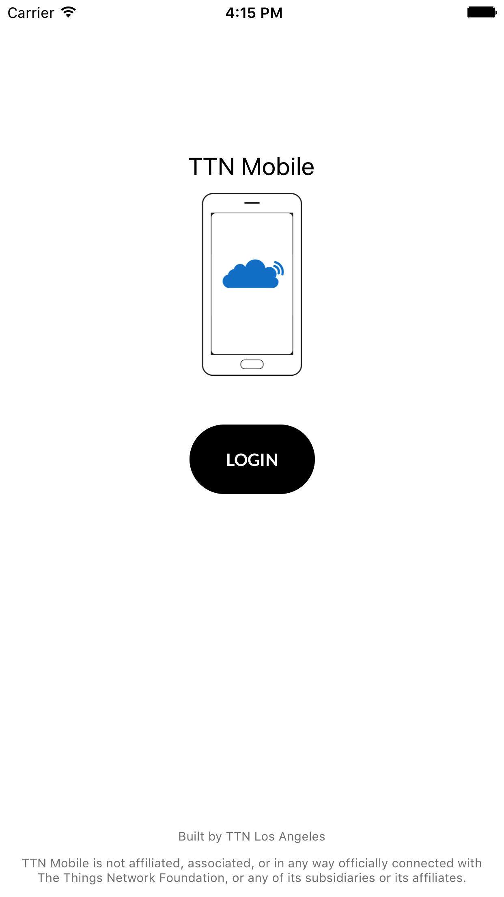
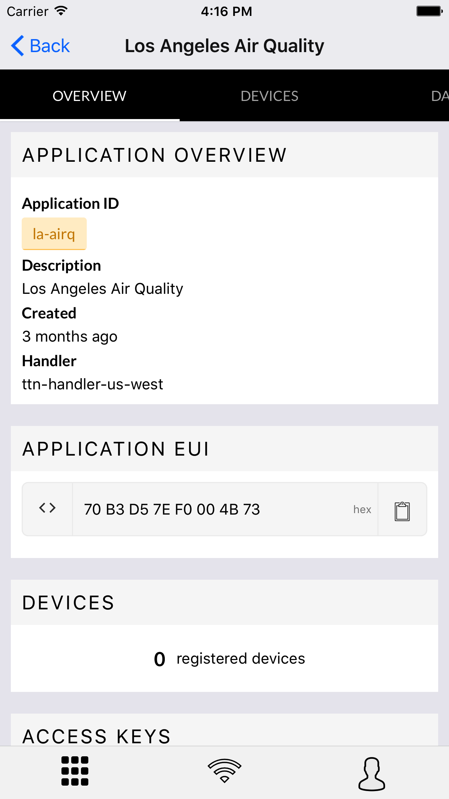
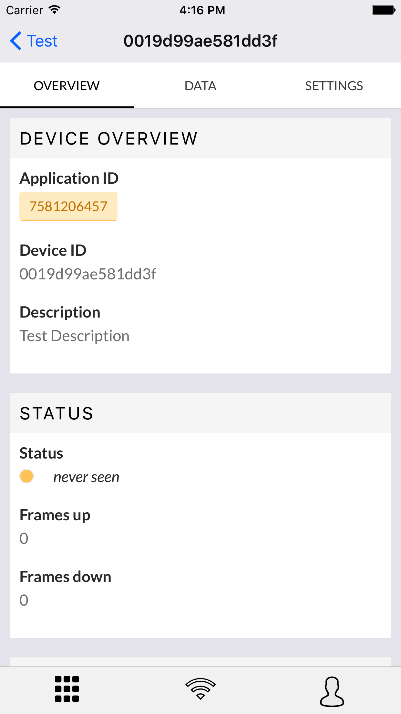
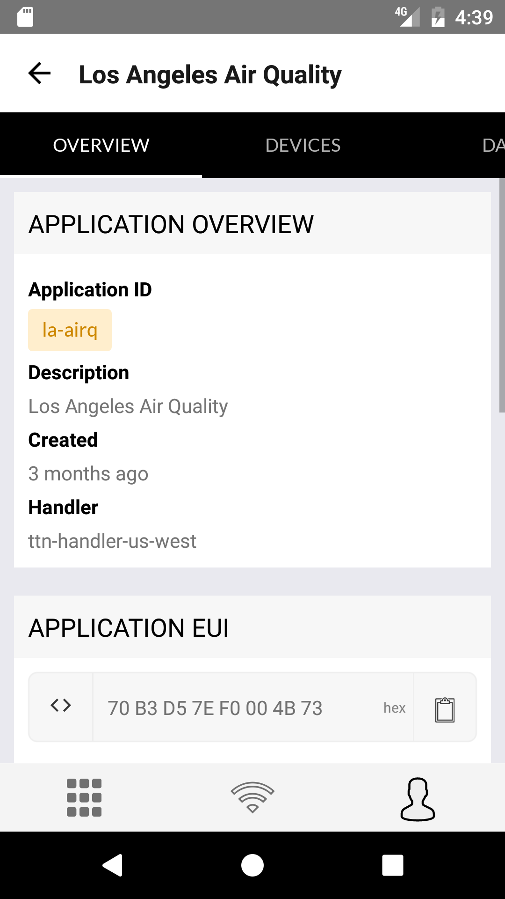
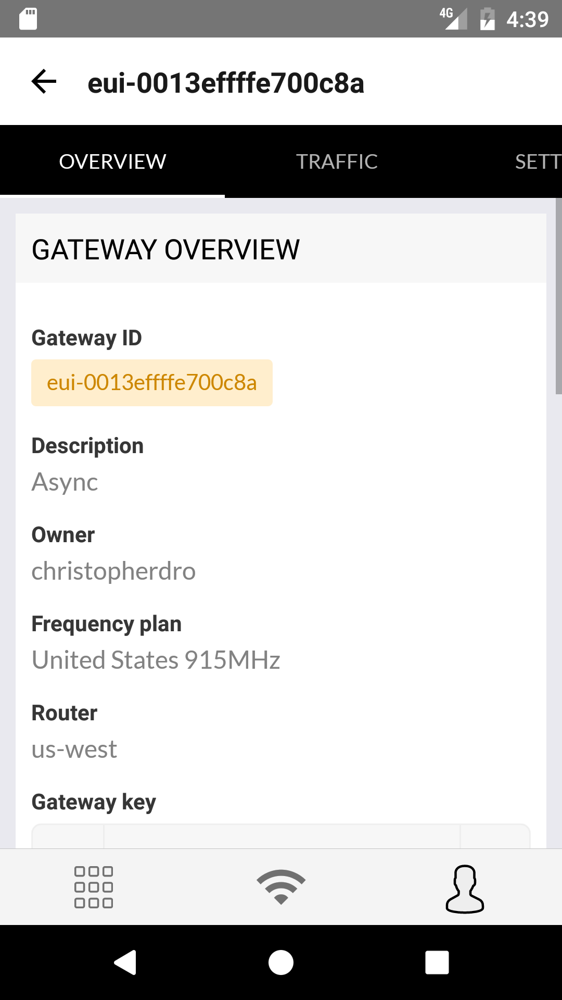

# TTN Mobile

### iOS
<div style="text-align:center">
  
  
  
</div>

### Android
<div style="text-align:center">
  
  
  
</div>

## Prerequisites

#### 1. Setup React Native (required)
TTN Mobile is built using Facebooks [React Native](https://facebook.github.io/react-native/) framework. Please follow the getting started guide located [here](https://facebook.github.io/react-native/docs/getting-started.html). We suggest following the **"Building Projects with Native Code"** section alongside **"Quick Start"**.

#### 2. Globally install [sentry-cli](https://github.com/getsentry/sentry-cli) (required)

#### 3. Install ESlint and Flow IDE plugin (recommended)


## Setup

#### 1. Clone repository

#### 2. Run `yarn setup`
This script will properly install all dependencies.

#### 3. Add your Oauth client id and secret in `src/config.env.js`
This file is auto generated from the setup script. You can enter these values manually or
set `TTN_CLIENT_ID` and `TTN_CLIENT_SECRET` as environment variables before running the script.

## Internationalization
We're using [react-intl](https://github.com/yahoo/react-intl). It provides React components and an API to format dates, numbers, and strings, including pluralization and handling translations.

```
<FormattedMessage
  id='app.general.yes'
  defaultMessage='Yes'
/>
---
<Text>Yes</Text>
```

`babel-plugin-react-intl` extracts all of the defaultMessages we have and puts it in `build/messages`. Our script file `scripts/translations.js` then takes all of those ids and default messages and writes a flat json object in `build/lang/en.json`. The translator would then create a new locale with the same keys and input the translations.
